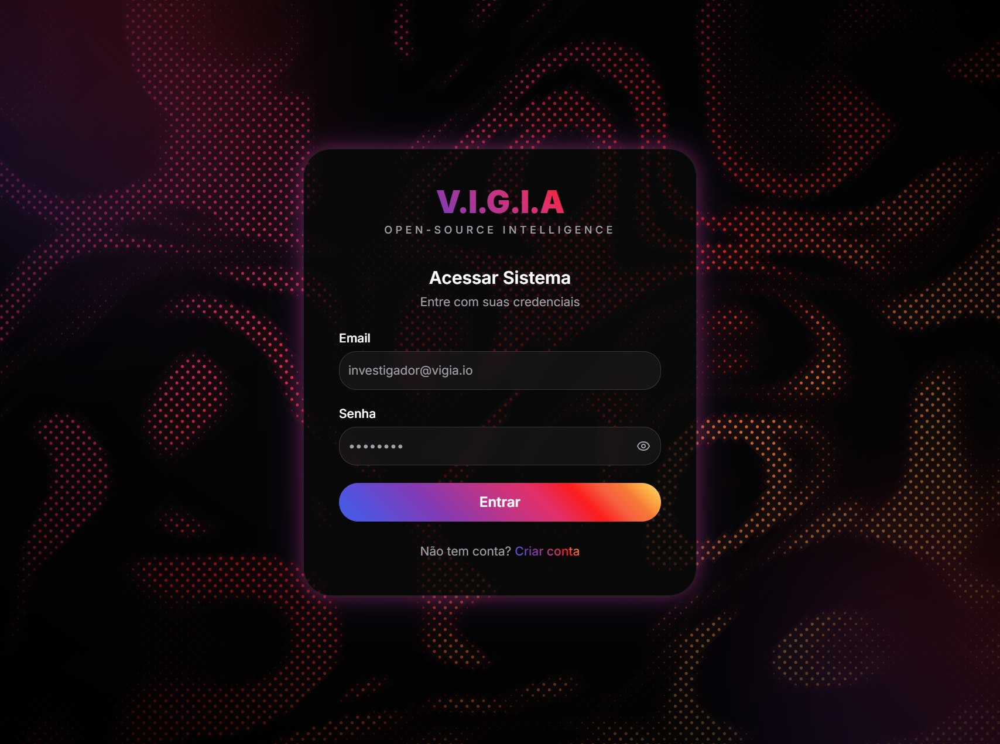
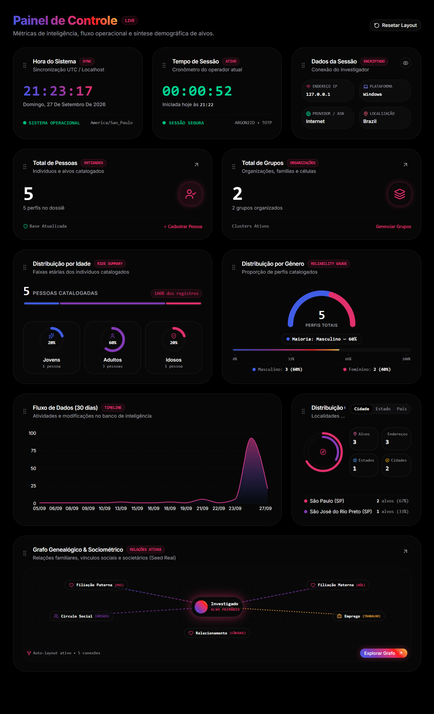
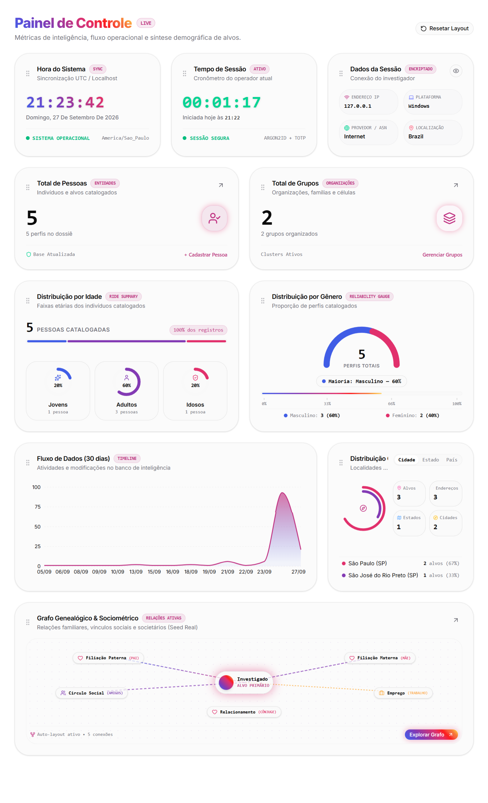
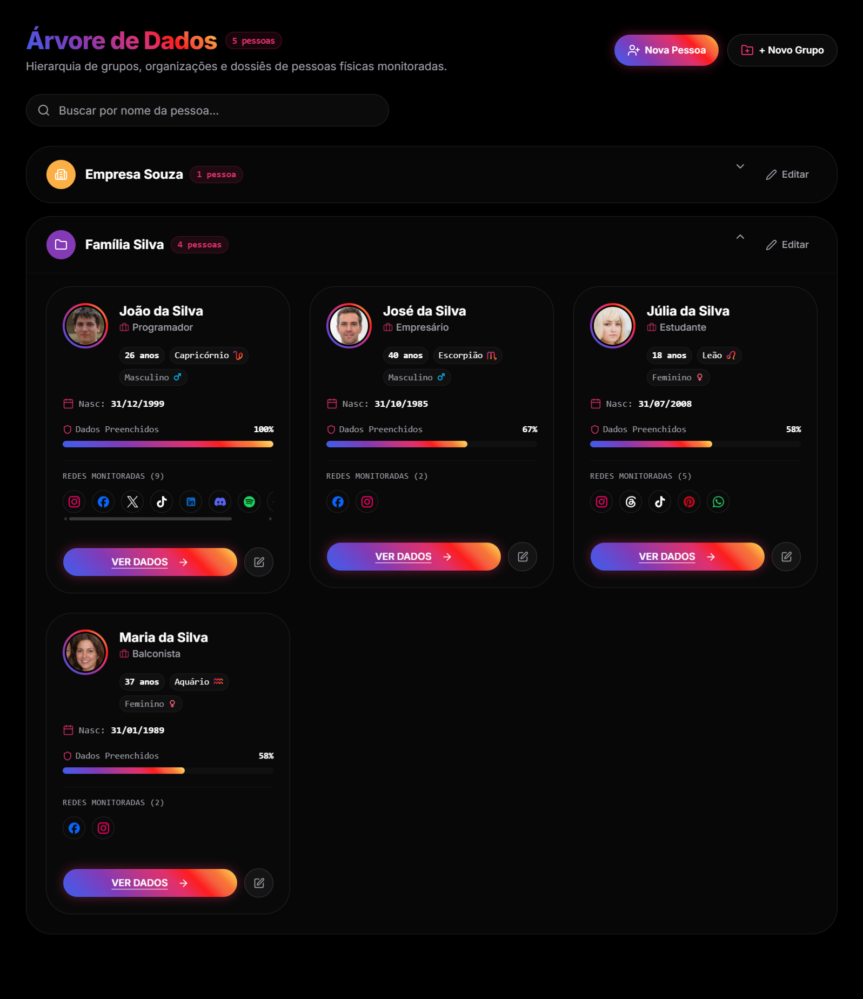
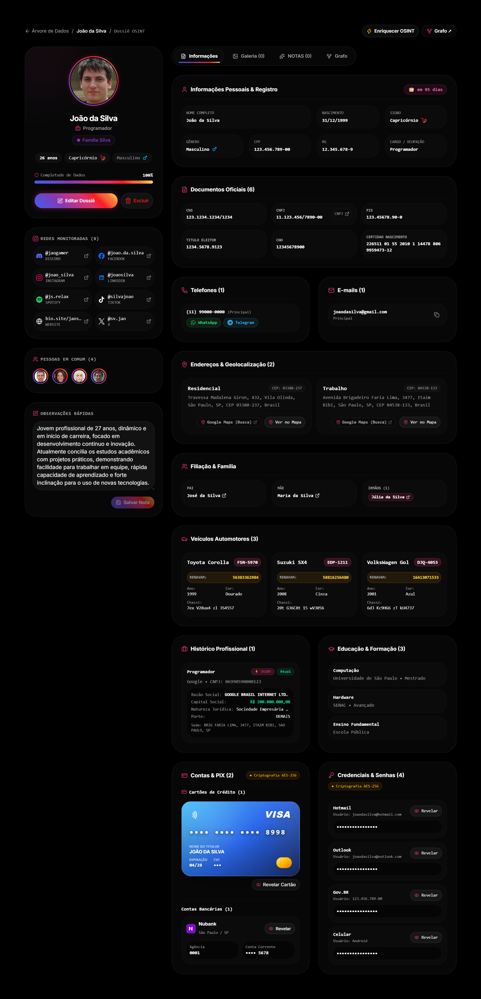
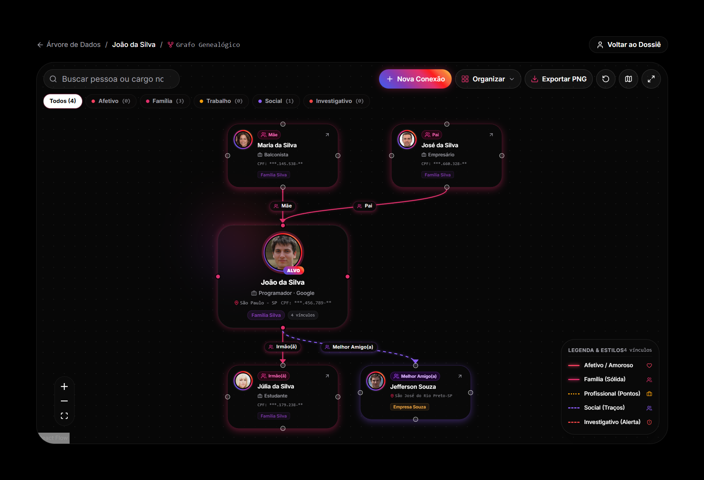

<div align="center">

# 🛡️ V.I.G.I.A
### Vigilância Integrada e Gestão de Informações Analíticas
**Plataforma Moderna de Inteligência Investigativa, Sociometria e OSINT**

[](docs/CHANGELOG.md)
[](LICENSE)
[](https://nextjs.org/)
[](https://www.prisma.io/)
[](https://www.postgresql.org/)
[](https://www.typescriptlang.org/)

<p align="center">
  <a href="#-o-que-é-o-vigia">Sobre</a> •
  <a href="#-galeria-de-capturas-de-tela">Galeria</a> •
  <a href="#-funcionalidades-por-módulo">Funcionalidades</a> •
  <a href="#-stack-tecnológica">Stack</a> •
  <a href="#-instalação--inicialização">Instalação</a> •
  <a href="#-scripts-disponíveis">Scripts</a> •
  <a href="#-troubleshooting-armadilhas-reais">Troubleshooting</a> •
  <a href="#-documentação-completa">Documentação</a> •
  <a href="#-licença">Licença</a>
</p>

</div>

---

## ⚖️ Aviso Ético e Legal (Disclaimer)

> [!IMPORTANT]
> **O V.I.G.I.A é um software voltado estritamente para uso legítimo em investigações formais, jornalismo investigativo, inteligência corporativa, segurança defensiva e pesquisa acadêmica, em estrita conformidade com a LGPD (Lei Geral de Proteção de Dados - Lei nº 13.709/2018) e legislações vigentes.**
>
> - **NÃO Realiza Web Scraping Abusivo**: A plataforma não contém rastreadores automatizados para capturar dados privados de redes sociais em massa.
> - **Uso de Fontes Legítimas e Dados Abertos**: Integra-se exclusivamente a serviços públicos e autorizados (como ViaCEP, BrasilAPI e OpenStreetMap).
> - **Custódia Responsável**: Toda informação inserida na plataforma é de inteira responsabilidade legal e operacional do operador do sistema.

---

## 📸 Galeria de Capturas de Tela

<div align="center">

### 1. Autenticação Segura & Shader WebGL

*Tela de login com shader WebGL com gradiente VIGIA, autenticação Better Auth e suporte a 2FA TOTP.*

---

### 2. Painel Analítico Principal — Tema BLACK OLED

*Dashboard com 10 widgets modulares arrastáveis, medidor Gauge de severidade de risco e série temporal.*

---

### 3. Painel Analítico Principal — Tema WHITE OLED

*Modo claro de alto contraste projetado para ambientes de alta iluminação diurna.*

---

### 4. Árvore de Dados e Organizações

*Visualização estruturada de alvos agrupados por organizações e facções com barras de completude cadastral.*

---

### 5. Dossiê Completo da Entidade

*Ficha detalhada com mapa Leaflet embutido, dados oficiais, contatos, veículos e registros financeiros cifrados.*

---

### 6. Grafo Genealógico & Sociométrico Interativo

*Canvas React Flow com auto-layout hierárquico, conexões arrastáveis e vínculos categorizados por cores.*

</div>

---

## 🛡️ O que é o V.I.G.I.A?

O **V.I.G.I.A** (*Vigilância Integrada e Gestão de Informações Analíticas*) é uma plataforma web completa para gestão, cruzamento e visualização de dados investigativos e inteligência de fontes abertas (OSINT).

Desenvolvido para suceder o antigo projeto **A.E.G.I.S** (desenvolvido em PHP/MySQL em 2024), o V.I.G.I.A foi inteiramente concebido e reescrito em **Next.js 16**, utilizando **PostgreSQL 18**, **Prisma 7**, **TypeScript** e **TailwindCSS v4**, entregando uma experiência *self-hosted* veloz, criptograficamente segura e visualmente marcante.

---

## ✨ Funcionalidades por Módulo

### 1. 🗂️ Dossiês Completos e Cadastro Especializado
- **11 Seções Temáticas**: Identificação, nascimento e signos, documentos oficiais (CPF, RG, CNH, Passaporte, NIS), contatos (WhatsApp, Telegram), e-mails, endereços com geolocalização, veículos com código RENAVAM, ocupações profissionais, histórico escolar, dados financeiros e relações genealógicas.
- **Criptografia Autenticada (AES-256-GCM)**: Dados bancários, chaves PIX e carteiras de criptomoedas são cifrados no banco com chave simétrica de 256 bits e IV único por registro.
- **Geolocalização com Leaflet**: Renderização do endereço principal em mapa interativo com tema Dark CartoDB.

### 2. 🌳 Árvore de Dados & Organizações
- Segmentação visual de entidades por facções, grupos corporativos ou alvos avulsos.
- Barra de progresso de inteligência calculando a integridade cadastral de cada perfil.
- Mapeamento de perfis em até 20 redes sociais e mensageiros.

### 3. 📊 Dashboard Analítico & EvilCharts
- **10 Widgets Modulares**: Reorganização livre por Drag-and-Drop (`@dnd-kit`) com persistência no navegador.
- **Gráficos Analíticos Nativos**: Medidor de Risco Médio estilo Gauge, Gráfico de Rosca por Organização e Linha de Cadastros (30 dias).
- **Modo Sigilo (Privacy Eye)**: Ocultação instantânea de identificadores na tela para proteger contra olhares curiosos (*shoulder surfing*).

### 4. 🕸️ Grafo Genealógico & Sociométrico (React Flow)
- Nós e arestas customizados com indicador de fotos, nível de risco e crachás de papel.
- **Categorização Visual de Vínculos**: Afetivo/Amoroso (Rosa), Família (Vinho), Profissional (Âmbar/Laranja), Social (Roxo) e Investigativo/Alerta (Vermelho).
- **Arrasto de Conexões (Drag-to-Connect)**: Conecte qualquer entidade a outra arrastando conectores circulares.
- **Algoritmos de Auto-Layout**: Hierárquico Vertical (TB), Horizontal (LR) e Radial/Concêntrico via Dagre.
- **Estabilidade Total**: Posições arrastadas são gravadas automaticamente no `localStorage` por entidade.
- **Exportação PNG**: Download instantâneo do grafo renderizado em alta definição.

### 5. 🖼️ Galeria de Mídias e Evidências
- Suporte a fotos (até 25 MB) e vídeos de monitoramento (até 100 MB).
- Grid em alvenaria (*masonry*), Lightbox com zoom e player de vídeo nativo.

### 6. 📝 Canvas Livre de Anotações & Hipóteses
- Espaço de trabalho com 7 widgets modulares: post-its neon, hipóteses, checklists, alertas críticos e **Cofre Confidencial protegido por senha própria**.

### 7. 🔍 Enriquecimento OSINT Automatizado
- Preenchimento de endereço via CEP (ViaCEP).
- Consulta cadastral de empresas e sócios via CNPJ (BrasilAPI).
- Geocodificação reversa de coordenadas (OpenStreetMap Nominatim).
- Consulta de ASN e provedor (IPinfo) e checagem de vazamentos (Have I Been Pwned).

### 8. 🔐 Segurança & Defesa Operacional
- Segundo Fator de Autenticação (**2FA TOTP**) nativo com geração de QR Code e códigos de recuperação.
- **Botão de Pânico (`Ctrl + Shift + Esc`)**: Bloqueio e saída emergencial de tela para URL neutra.
- **Modo Descartável (Burner Mode)**: Sessão sem rastros persistidos em disco.
- Trilha de auditoria imutável (`AuditLog`) com registro de IP e User-Agent.

### 9. 🎨 Design OLED & Microinterações
- Temas **BLACK OLED** (preto `#000000` puro) e **WHITE OLED**.
- Fundo dinâmico com Shader WebGL de alta resolução e gradiente VIGIA.
- Animações fluidas com `motion/react`.

---

## 🧱 Stack Tecnológica

| Componente | Tecnologia | Versão | Função na Arquitetura |
|---|---|---|---|
| **Framework Web** | Next.js (App Router) | `16.3.5` | SSR, Server Actions, API Routes |
| **Linguagem** | TypeScript | `5.x` | Tipagem estrita de ponta a ponta |
| **Banco de Dados** | PostgreSQL | `18.6` | Armazenamento relacional e Views SQL |
| **ORM** | Prisma com pg-adapter | `7.10.0` | Modelagem, migrações e consultas tipadas |
| **Cache & Filas** | Redis | `8-alpine` | Sessões em cache e filas BullMQ |
| **Autenticação** | Better Auth | `1.7.5` | Sessões seguras, cookies e 2FA TOTP |
| **Estilização** | TailwindCSS | `4.x` | Design system OLED e tokens responsivos |
| **Grafos** | @xyflow/react + @dagrejs/dagre | `12.x / 3.x` | Canvas sociométrico e cálculo de layout |
| **Mapas** | Leaflet | `1.9.4` | Renderização geográfica com tiles CartoDB |
| **Drag & Drop** | @dnd-kit (core, sortable) | `6.x / 10.x` | Reordenação de widgets no Dashboard |
| **Animações** | Motion (motion/react) | `13.x` | Microinterações e transições suaves |

---

## 💻 Pré-requisitos do Sistema

- **Docker**: `>= 24.0.0` com **Docker Compose v2**
- **Node.js**: `>= 22.0.0`
- **npm**: `>= 10.0.0`
- **Memória RAM**: Mínimo de 4 GB livre
- **Portas Disponíveis**: `3000` (Next.js), `5432` (PostgreSQL), `6379` (Redis)

---

## ⚡ Instalação & Inicialização

### Opção 1: Quick-Start Universal (Recomendado)

```bash
git clone https://github.com/AsmVoid/vigia.git
cd vigia
bash scripts/bootstrap.sh   # sobe Docker, aplica migrations, gera Prisma Client
npm run dev                 # http://localhost:3000
# Registre sua primeira conta em /register (não há login padrão)
```
O script `bootstrap.sh` prepara automaticamente o arquivo `.env` com chaves criptográficas geradas via OpenSSL, inicializa o PostgreSQL 18 e o Redis 8 no Docker, executa as migrações e Views SQL e compila o Prisma Client.

### Opção 2: Instalação por Distribuição Linux

#### Arch Linux
```bash
sudo pacman -Syu docker docker-compose nodejs npm git openssl
sudo systemctl enable --now docker
sudo usermod -aG docker $USER && newgrp docker
git clone https://github.com/AsmVoid/vigia.git && cd vigia
npm run setup
```

#### Ubuntu / Debian
```bash
curl -fsSL https://get.docker.com | sudo sh
curl -fsSL https://deb.nodesource.com/setup_22.x | sudo -E bash -
sudo apt install -y nodejs git openssl
sudo usermod -aG docker $USER
git clone https://github.com/AsmVoid/vigia.git && cd vigia
npm run setup
```

#### Windows 10 / 11 via WSL2
O V.I.G.I.A roda com máxima performance no WSL2 Ubuntu, **sem necessidade do Docker Desktop**:
```powershell
# No PowerShell como Administrador:
wsl --install -d Ubuntu-24.04
```
Dentro do terminal Ubuntu do WSL2:
```bash
# Habilitar systemd no WSL2 (/etc/wsl.conf):
sudo bash -c 'echo -e "[boot]\nsystemd=true" > /etc/wsl.conf'

# Instalar Docker oficial e Node.js 22:
curl -fsSL https://get.docker.com | sudo sh
curl -fsSL https://deb.nodesource.com/setup_22.x | sudo -E bash -
sudo apt install -y nodejs git openssl
sudo usermod -aG docker $USER

# Clonar e inicializar:
git clone https://github.com/AsmVoid/vigia.git && cd vigia
npm run setup
```

---

## 🧪 Dados de Demonstração (Seed Opcional)

Para carregar dados fictícios realistas de pessoas, veículos, redes sociais e conexões de teste:
```bash
npx prisma db seed
```

---

## 📜 Scripts Disponíveis (`package.json`)

| Comando | Descrição |
|---|---|
| `npm run dev` | Inicia o servidor Next.js em modo desenvolvimento (`http://localhost:3000`) |
| `npm run build` | Compila a versão otimizada para produção |
| `npm start` | Inicia o servidor Next.js em modo produção |
| `npm run setup` | Executa o bootstrap idempotente do ambiente (`scripts/setup.sh`) |
| `npm run reset` | Executa o factory reset completo, zerando banco e uploads (`scripts/reset.sh`) |
| `npm run backup` | Gera um backup compactado do PostgreSQL e mídias (`scripts/backup.sh`) |
| `npm run restore` | Restaura um backup a partir de `backups/` (`scripts/restore.sh`) |
| `npm run update` | Puxa novas versões do git, roda migrações e recompila (`scripts/update.sh`) |
| `npm run db:up` | Sobe os contêineres do PostgreSQL e Redis em segundo plano |
| `npm run db:down` | Encerra os contêineres Docker |
| `npm run db:studio` | Abre a interface gráfica web do Prisma Studio |
| `npm run db:views` | Recria as Views analíticas em SQL nativo no PostgreSQL |

---

## 📁 Estrutura de Pastas

```text
vigia/
├── app/                        # Rotas do Next.js (Auth, Dashboard, Dossiês, Grafo, Galeria)
├── components/                 # Componentes React modulares (Dashboard, Entity, Tree, Graph)
├── docs/                       # Documentação técnica detalhada e manuais
│   └── screenshots/            # Imagens reais de demonstração da interface
├── lib/                        # Camada de lógica, criptografia AES-256, autenticação e filas
├── prisma/                     # Schema relacional, migrações e Views SQL
├── public/uploads/people/      # Diretório de armazenamento de fotos e mídias
├── scripts/                    # Scripts de automação operacional em Bash
├── docker-compose.yml          # Definição dos serviços PostgreSQL 18 e Redis 8
├── package.json                # Manifesto de dependências e metadados
└── LICENSE                     # Licença completa GNU AGPL v3
```

---

## 🔒 Segurança e Privacidade

- **Criptografia Simétrica Forte**: Todos os campos financeiros sensíveis e notas do cofre utilizam `AES-256-GCM` com verificação de integridade via tag de autenticação.
- **Cookies Seguros & HttpOnly**: Impossíveis de serem acessados via scripts maliciosos no cliente (mitigação de XSS).
- **Hardening e Boas Práticas**: Consulte o guia completo em [docs/SECURITY.md](docs/SECURITY.md).

---

## 💾 Rotinas de Backup & Restauração

### Criando um Backup
```bash
# Backup padrão (Banco PostgreSQL compactado + mídias de uploads + schema):
npm run backup

# Backup incluindo o arquivo .env (contendo chaves criptográficas):
npm run backup -- --include-env
```
Os arquivos são organizados automaticamente em `backups/vigia-YYYYMMDD-HHMMSS/`.

### Restaurando um Backup
```bash
npm run restore backups/vigia-20260928-120000
```

---

## ⚠️ Troubleshooting (Armadilhas Reais do Projeto)

Durante o desenvolvimento do V.I.G.I.A, identificamos particularidades críticas que devem ser observadas:

1. **PostgreSQL 18 — Volume em `/var/lib/postgresql`**:
   - No PostgreSQL 18+, **não monte volumes diretamente em `/var/lib/postgresql/data`**.
   - Monte o volume na pasta pai: `- vigia_pgdata:/var/lib/postgresql`. O contêiner gerencia e cria autonomamente o subdiretório versionado `18/docker`. Montar em `/data` corrompe a inicialização do cluster.
2. **Prisma 7 — Configuração de Datasource URL**:
   - O Prisma 7 **não aceita a propriedade `url` diretamente dentro do bloco `datasource` no `schema.prisma`**.
   - A URL de conexão deve ser informada em `prisma.config.ts` através de `export default defineConfig({ datasource: { url: ... } })` e consumida via `@prisma/adapter-pg`.
3. **npm 12 — Bloqueio de Install Scripts**:
   - Versões recentes do npm bloqueiam scripts de instalação de binários nativos do Prisma e do esbuild.
   - Utilize a configuração `"allowScripts"` no `package.json` ou aprove via `npm install-scripts approve` caso receba avisos de bloqueio.
4. **Zod v4 com React Hook Form**:
   - Para compatibilidade de tipagem com o Zod v4, utilize `@hookform/resolvers/zod` com `standardSchemaResolver` para evitar divergências em assinaturas de schemas complexos.
5. **Tiles do Leaflet sem Chave de API**:
   - Para não depender de chaves pagas ou rate limits externos, utilizamos as camadas gratuitas de alto contraste do CartoDB:
   - Modo Escuro: `https://{s}.basemaps.cartocdn.com/dark_all/{z}/{x}/{y}{r}.png`
   - Modo Claro: `https://{s}.basemaps.cartocdn.com/light_all/{z}/{x}/{y}{r}.png`

### 🔧 Troubleshooting pós-clone

Se você acabou de clonar o repositório em uma nova máquina ou ambiente e encontrar algum erro:

- **"Erro 422 ao criar conta"** → rode `npm install && bash scripts/bootstrap.sh`
- **"Module not found @/generated/prisma/client"** → `npx prisma generate`
- **"relation does not exist"** → `npx prisma migrate deploy`

---

## 📚 Documentação Completa

Para aprofundar-se em aspectos específicos do sistema, consulte os documentos na pasta [`docs/`](docs/):

| Documento | Conteúdo |
|---|---|
| [docs/GETTING_STARTED.md](docs/GETTING_STARTED.md) | Guia completo de instalação passo a passo por sistema operacional e primeiro acesso |
| [docs/FEATURES.md](docs/FEATURES.md) | Manual minucioso descrevendo todas as funcionalidades módulo a módulo |
| [docs/ARCHITECTURE.md](docs/ARCHITECTURE.md) | Arquitetura técnica, modelo relacional, Server Actions e fluxo de dados |
| [docs/SECURITY.md](docs/SECURITY.md) | Modelo de ameaças, políticas de criptografia e guia de hardening para produção |
| [docs/CONTRIBUTING.md](docs/CONTRIBUTING.md) | Orientações para desenvolvedores, convenção de commits e fluxo de PRs |
| [docs/CHANGELOG.md](docs/CHANGELOG.md) | Histórico completo de versões, novas funcionalidades e correções de bugs |
| [docs/PUBLISHING.md](docs/PUBLISHING.md) | Instruções para publicação oficial do repositório no GitHub |
| [docs/PRD.md](docs/PRD.md) | Documento de Requisitos do Produto original |
| [docs/AI-PROMPTS.md](docs/AI-PROMPTS.md) | Registro de prompts e instruções de engenharia do sistema |

---

## 🤝 Contribuição & Código de Conduta

Contribuições são muito bem-vindas!
1. Consulte o [docs/CONTRIBUTING.md](docs/CONTRIBUTING.md) para detalhes sobre nosso fluxo de desenvolvimento.
2. Todo participante compromete-se a seguir nosso [Código de Conduta](CODE_OF_CONDUCT.md).
3. Para relatar bugs ou sugerir melhorias, utilize nossos templates em [.github/ISSUE_TEMPLATE](.github/ISSUE_TEMPLATE).

---

## 📄 Licença

Este projeto está licenciado sob os termos da **GNU Affero General Public License v3.0 (AGPL-3.0-only)**.

### Por que a licença AGPL v3?
A licença **AGPL-3.0** é uma licença copyleft robusta criada pela Free Software Foundation especificamente para softwares que rodam em servidores ou serviços web (*network server software*). Diferente de licenças permissivas que permitem a apropriação fechada do código, a AGPL garante que qualquer modificação, aprimoramento ou distribuição do V.I.G.I.A — inclusive quando disponibilizado como serviço através de uma rede de computadores — **deva ter seu código-fonte correspondente liberado publicamente para a comunidade**.

Consulte o texto oficial integral em [LICENSE](LICENSE).

```text
V.I.G.I.A — Vigilância Integrada e Gestão de Informações Analíticas
Copyright (C) 2026 AsmVoid
```

---

<div align="center">

**V.I.G.I.A** — Desenvolvido com excelência técnica e foco em inteligência defensiva.  
*Copyright © 2026 AsmVoid. Todos os direitos reservados sob GNU AGPL v3.*

</div>
